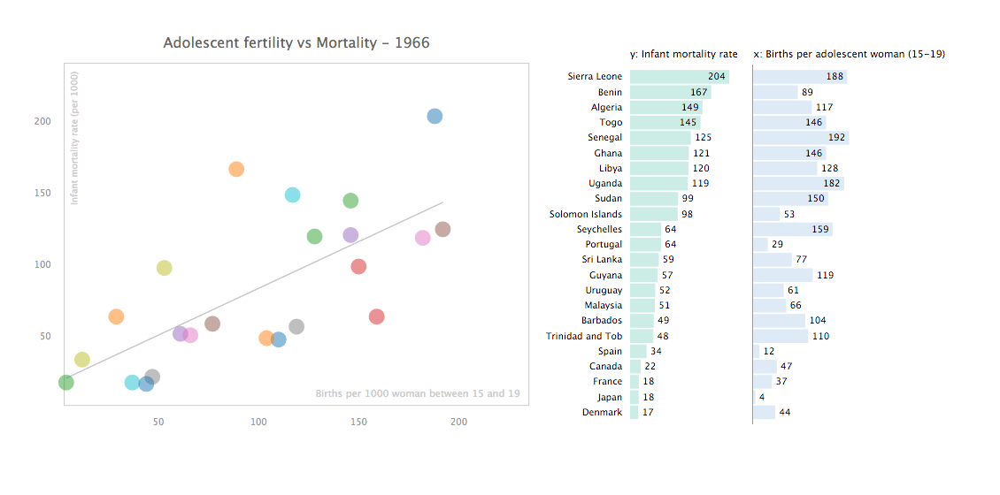
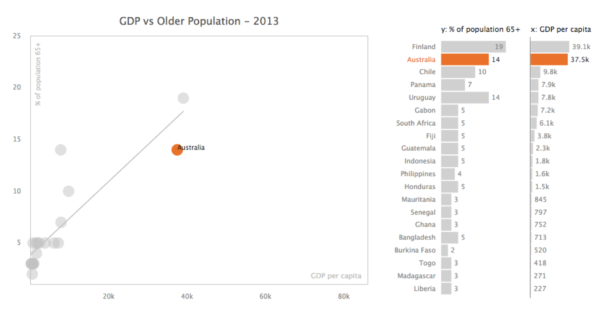
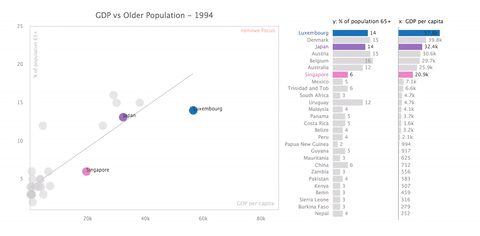

### The worldbank scatterplots

The [Worldbank Data Interface](http://larsvers.github.io/worldbank-data-interface/) attempts to give a good overview of where the world has been heading in the past 50 years. One part of the interface is the *Explore* section allowing users to find associations between 2 or 3 variables against the backdrop of time. 3 features to shine some light on: 

First, scatterplots still welcome help from more traditional means of data visualization. Especially, in business settings there will be users not acquainted with or inclined to learn how to read scatterplots. A simple addition of bar-charts representing each individual variable goes a long way here. 

Second, the bar charts and the scatterplot implement linked highlighting. Hovering over a data point or a bar chart label will grey out all points and bars apart from the selected one. Clicking will lock this data point in. This is also my excuse to still give each scatter point a different colour. If colour was the only means to distinguish between the points the visual would be unreadable. Yet the combination of colour, highlighting as well as labelling allows for good navigation and cognition.

Third, all scatterplots can be time-animated showing the development of the association from - in our case - 1961 to 2013. This way animation adds an additional time variable to the set-up, explaining the history of the potential relation in under a minute. 

--

For the full worldbank data interface come over [here](http://larsvers.github.io/worldbank-data-interface/)
